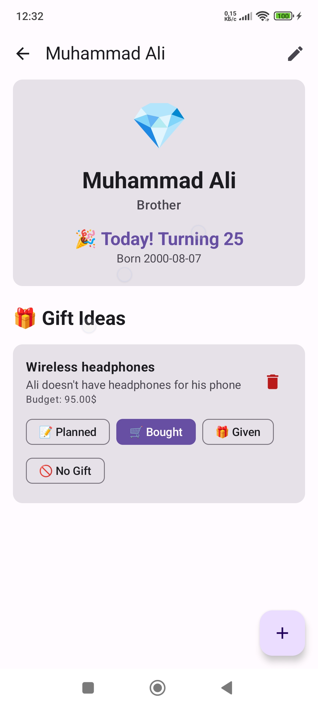

🎁 GiftNote - Birthday & Gift Reminder App
Welcome to the GiftNote repository! GiftNote is a thoughtfully designed Android application that
helps users keep track of birthdays and gift ideas. Never miss a special day again — plan thoughtful
gifts, schedule reminders, and manage important dates all in one place.

📱 App Overview
GiftNote is a user-friendly app that allows people to:

Track birthdays of friends and loved ones.

Store and manage personalized gift ideas for each person.

Receive timely notifications and reminders before birthdays.

Stay organized for celebrations with a clean, modern UI.

Built with Kotlin, Jetpack Compose, and following MVVM architecture, the app ensures maintainability
and performance on modern Android devices.

🚀 Features
🎂 Birthday Manager: Add, view, edit, and delete birthdays with ease.

🎁 Gift Ideas: Attach multiple gift ideas to each birthday with notes.

⏰ Reminders: Get birthday reminders at exact times using AlarmManager.

🌙 Dark Mode: Seamless dark theme support based on system settings or user choice.

🔕 Notification Control: Toggle birthday notifications on or off.

🔍 Search & Filter: Quickly find people or gift ideas from your list.

🧭 Modern Navigation: Built with Voyager for clean screen transitions.

🧱 Architecture
The app follows a clean MVVM architecture:

Model: Room Database entities for birthdays and gift ideas.

ViewModel: Holds UI logic and state using StateFlow.

View: Jetpack Compose UI built with state observation.

Navigation: Voyager simplifies screen transitions and argument passing.

⚙️ Technologies Used
Tool / Library Purpose
Kotlin Programming language
Jetpack Compose Declarative UI framework
Room Local database for storing data
Hilt Dependency Injection
DataStore Persist app settings like theme or toggles
AlarmManager Schedule precise birthday notifications
Voyager Navigation between screens
StateFlow + MVVM State management and reactive UIs

📸 Screenshots

<table>
<td></td> 
<td></td> 
<tr> 
<td> </td>
<td></td> 
<td></td> 
<td></td>
</tr>
<tr> 
<td></td> 
<td></td> 
<td></td> 
<td></td> 
</tr> 
</table>